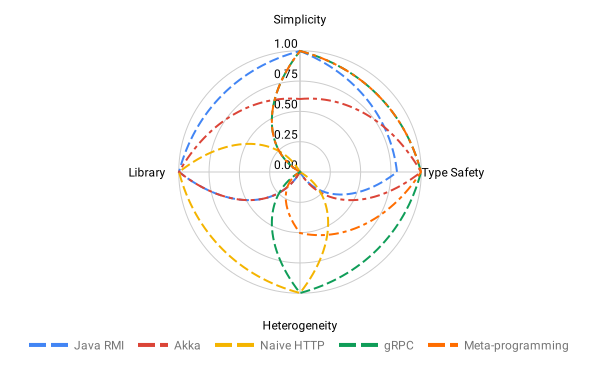

% Endpoints
% A Quest for the Right Level of Coupling
   
  [http://julienrf.github.io/2019/endpoints](http://julienrf.github.io/2019/endpoints)

### Agenda {.unnumbered}

- Motivation
- Demo
- Design

# Motivation

## Context

### Monolith {.unnumbered}

### Monolith: Pros & Cons {.unnumbered}

#### Pros {.unnumbered}

- Simplicity

#### Cons {.unnumbered}

- Rigidity
- Scalability

### Distributed {.unnumbered}

### Distributed: Pros {.unnumbered}

- Flexibility
    - Independent teams, tech stacks, deployments
- Scalability
    - Scale out just the critical nodes

### Distributed: Cons {.unnumbered}

- Complexity
    - Communication across program boundaries
    - Dependencies between nodes

### Crossing Program Boundaries {.unnumbered}

## How Do We Cross Program Boundaries in Practice?

### Java RMI {.unnumbered}

~~~ scala
val b: B = service.compute(a)
~~~

> - Remote invocation as an `A => B` function!
> - Compile-time errors

### Java RMI: Cons {.unnumbered}

> - Blocking, inefficient
> - No streaming
> - Network failures surface as runtime exceptions

### Illusion of Transparency {.unnumbered}

> “Distribution transparency is impossible to achieve in practice. Precisely
> because of that impossibility, it is **dangerous** to provide the **illusion of
> transparency**”. [Rachid Guerraoui et al., 1999](http://www.engr.sjsu.edu/fayad/column/CACM/ACMPub/p101-guerraoui.pdf)

### Akka {.unnumbered}

~~~ scala
import akka.actor.typed.scaladsl.AskPattern._

val eventualB: Future[B] = refA.ask(refB => Compute(a, refB))
~~~

- Non-blocking, efficient
- Streaming (with Akka Streams)
- Same guarantees for local and remote invocations
    - Location transparency is not a lie!

### Akka: Cons {.unnumbered}

> - All the nodes have to use the Akka communication protocol
>     - Not appropriate to expose a public API
> - Remote invocation as an `(A, ActorRef[B]) => Unit` function
>     - Tedious plumbing

### HTTP Services {.unnumbered}

~~~ scala
val eventualB: Future[B] =
  httpClient.post("/compute", a.toJson)
    .filter(_.status == 200)
    .flatMap(_.entity.asJson.to[B])
~~~

- Clients and servers can have their own tech stack
- HTTP APIs can be documented (both in human-readable and machine-readable ways)

### HTTP Services: Cons {.unnumbered}

- Building HTTP requests is tedious
- Documenting an HTTP API is tedious
- Untyped
    - No compile-time guarantee that requests are well-formed
    - No IDE assistance

### WSDL {.unnumbered}

~~~ scala
val eventualB: Future[B] = service.compute(a)
~~~

(assuming that you have generated `service` implementation class with
a tool like scalaxb)

- Brings back type-safety
- Makes invocation simple

### WSDL: Cons {.unnumbered}

- No streaming
- XML service definitions are tedious to read or write
- Relies on code generation
    - Requires extra step in build
    - Generated code sometimes does not compile
    - Generated code may impose constraints on the way it can be used

### gRPC {.unnumbered}

- Service definitions written in a human-readable format
- Better performance (HTTP2, binary serialization)
- Streaming
- Data types evolution via protobuf?
- But still, relies on code generation!

### Meta-Programming {.unnumbered}

Idea: mitigate code generation issues by synthesizing code
with macros instead

~~~ scala
trait Api {
  def compute(a: A): B
}

val api = synthesized.Client[Api]
val eventualB: Future[B] = api.compute(a)
~~~

### Meta-Programming: Cons {.unnumbered}

- Poor tooling support
- Second-class citizen

### Summary {.unnumbered}

# Demo

# Design

### Just a Plain Old Library {.unnumbered}

### First-Class Scala Values {.unnumbered}

- No code generation
- No new language
- Seamless integration in your project

### No Macros {.unnumbered}

- No surprising semantics
- IDE friendly

### Modularity {.unnumbered}

### Modularity² {.unnumbered}

### Extensibility {.unnumbered}

## Questions?

## Appendix

### *endpoints* vs Tapir {.unnumbered}

[Tapir](https://tapir-scala.readthedocs.io/en/latest/) uses a closed endpoint
description language, whereas *endoints* uses an extensible description language.
